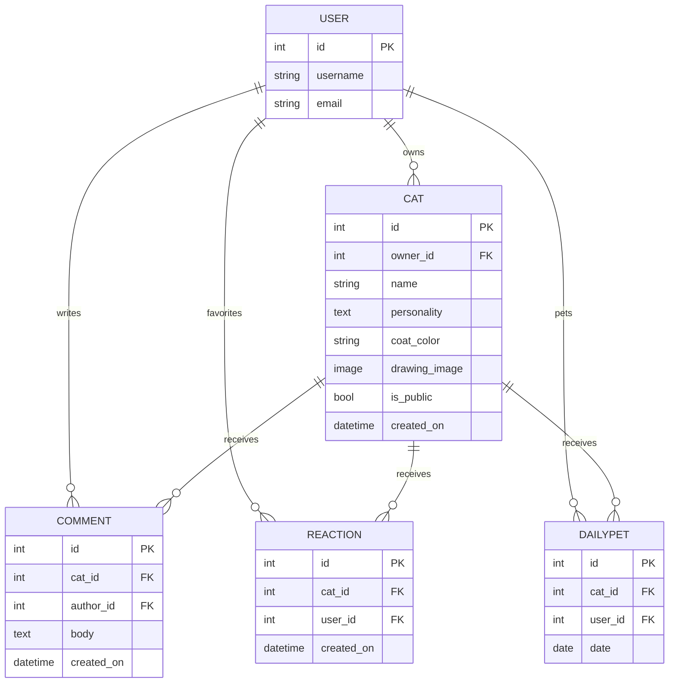

# 🗂️ Data Model MoniCat Manor

This document expands on the ERD summary in the main [README](README.md#data-model),
covering the reasoning behind each model, field, and relationship.

---

## Entity Relationship Diagram

---

## Planning process

Before writing any models, the core question was: what actually needs to
be *stored*, versus what can be *computed on the fly*?

Two interactions were originally considered as a single "likes" feature,
but were deliberately split into two separate models (`Reaction` and
`DailyPet`) once it became clear they had fundamentally different
lifecycles:

- A **favorite** is permanent. It should never silently reset, and a
  visitor should be able to see at a glance which cats they've favorited
  in the past, indefinitely.
- A **daily pet** is intentionally temporary. It exists to power a
  recurring reason to return each day (the Cat of the Day spotlight),
  and *should* reset every 24 hours.

Modeling these as one field (e.g. a single "likes" counter incremented
on click) would have made it impossible to tell these two behaviours
apart, or to reset only one of them. Splitting them into two models,
each with its own `unique_together` constraint, keeps both behaviours
independently correct without extra application-level bookkeeping the
database itself guarantees "one favorite per user per cat, ever" and
"one pet per user per cat per day" are impossible to violate, rather
than relying on view level logic to enforce it.

---

## Model: `Cat`

The central model — a single hand-drawn cat portrait.

| Field | Type | Reasoning |
|---|---|---|
| `owner` | `ForeignKey(User, on_delete=CASCADE)` | Every cat belongs to exactly one user. `CASCADE` deletes a user's cats if their account is deleted, avoiding orphaned rows with no owner. |
| `name` | `CharField(max_length=50)` | Short by design. This is a pet name, not a biography. |
| `personality` | `TextField(max_length=300)` | Longer free-text field, but still capped to keep cat profile cards a predictable size in the UI. |
| `coat_color` | `CharField(choices=COAT_COLOR_CHOICES, default='deep_blue')` | Constrained to a fixed palette (`deep_blue`, `periwinkle`, `dusty_violet`, `mint`, `rose`, `honey`, `ink_brown`, `classic`) rather than a free-text or raw hex field, so every cat's color always matches the site's actual brand palette — no visitor can submit an off-brand or invalid color. The `data-value` attributes in the canvas swatch picker (`cat_form.html`) must exactly match these choice keys. |
| `drawing_image` | `ImageField(upload_to='cats/')` | Stored via Cloudinary in every environment (see README's Deployment section) since Heroku's filesystem is ephemeral and can't be relied on for persistent media. |
| `is_public` | `BooleanField(default=True)` | Lets an owner hide a cat from the shared manor/gallery without deleting it a lighter weight action than full deletion, and reversible. |
| `created_on` / `updated_on` | `DateTimeField(auto_now_add=True)` / `DateTimeField(auto_now=True)` | Standard audit timestamps; `created_on` also drives the model's default ordering. |

**Meta:** `ordering = ['-created_on']` newest cats appear first by
default. This matters specifically because `SceneView` annotates the
queryset with a pet count before paginating it and annotation can silence
Django's implicit default ordering, so the view also sets an explicit
`.order_by('-created_on')` rather than relying on `Meta.ordering` alone
(see README bug #28).

---

## Model: `Comment`

| Field | Type | Reasoning |
|---|---|---|
| `cat` | `ForeignKey(Cat, on_delete=CASCADE, related_name='comments')` | A comment always belongs to exactly one cat; deleting the cat removes its comments rather than leaving orphaned rows. |
| `author` | `ForeignKey(User, on_delete=CASCADE, related_name='comments')` | Tracks who wrote it, for ownership-based edit/delete permissions. |
| `body` | `TextField(max_length=500)` | Generous length for a genuine comment, while still bounded. |
| `created_on` | `DateTimeField(auto_now_add=True)` | Drives ordering and the displayed timestamp. |

**Meta:** `ordering = ['created_on']` — **oldest first**, deliberately
the opposite of `Cat`'s ordering. A comment thread reads naturally in
chronological order (like a conversation), whereas a gallery of cats
reads naturally newest-first (like a feed).

---

## Model: `Reaction`

The permanent "paw" favorite.

| Field | Type | Reasoning |
|---|---|---|
| `cat` | `ForeignKey(Cat, on_delete=CASCADE, related_name='reactions')` | |
| `user` | `ForeignKey(User, on_delete=CASCADE, related_name='reactions')` | |
| `created_on` | `DateTimeField(auto_now_add=True)` | Not currently displayed, but kept for potential future features (e.g. "recently favorited") without a migration. |

**Meta:** `unique_together = ('cat', 'user')` The database itself
guarantees a user can never favorite the same cat twice. The
`toggle_reaction` view relies on this: it uses `get_or_create()` and,
if the row already existed, deletes it and a clean toggle with no risk of
duplicate rows even under rapid double clicks, since the constraint
would reject a second insert outright.

---

## Model: `DailyPet`

The resetting daily interaction that powers Cat of the Day.

| Field | Type | Reasoning |
|---|---|---|
| `cat` | `ForeignKey(Cat, on_delete=CASCADE, related_name='pets')` | |
| `user` | `ForeignKey(User, on_delete=CASCADE, related_name='daily_pets')` | |
| `date` | `DateField(default=timezone.localdate)` | Deliberately a `DateField`, not `DateTimeField` The day is what matters for uniqueness, not the exact time. Using `timezone.localdate` as the default (evaluated per-row at creation) rather than a fixed default keeps every pet correctly attributed to the day it actually happened. |

**Meta:** `unique_together = ('cat', 'user', 'date')` — guarantees at
most one pet per user, per cat, per calendar day. This is what makes
"already petted today" detection trivial and race condition proof: the
`pet_cat` view attempts `get_or_create()`, and the database itself
rejects a second same day row rather than the application needing to
check then insert (which would have a race condition window between
the check and the insert under concurrent requests).

**Why a separate model instead of a field on `Cat`:** Cat of the Day
needs to know *today's* pet count specifically, recomputed fresh every
day, without losing the historical record of past days. A single
"total pets" counter on `Cat` couldn't reset daily without losing all
history; a separate row per pet, filterable by date, can be aggregated
per day on demand (`Count('pets', filter=Q(pets__date=today))`) while
still preserving a full history if it's ever needed later.

---

## Cross-cutting design decisions

**Why `Cat.objects.filter(is_public=True)` appears in almost every
public facing view, rather than a model-level default manager:** keeping
the filter explicit at the view level (rather than hiding it inside a
custom manager) makes it obvious, at the point each query set is built,
exactly which views are public-safe and which intentionally show a
user's own private cats too (`MyCatsView`). A hidden default manager
risks someone forgetting it's there and accidentally leaking private
cats through a new view that doesn't know to opt out of it.

**Why `Cat of the Day` requires a strict majority, not just the highest
count:** see `get_cat_of_the_day()` in `cats/views.py` and README bug
#34 — a tie for first place shows no spotlight at all, rather than
picking a winner at random, since a random pick would be unstable
across page reloads and misleading about who's "actually" winning.