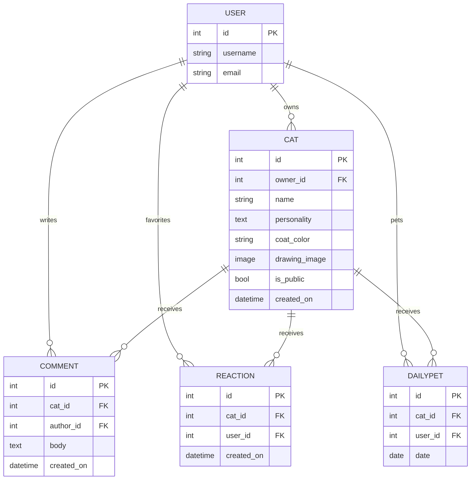

# 🏰🐱 MoniCat Manor

> Draw a cat. Name it. Give it a personality. Watch it join a shared, illustrated
> manor with everyone else's cats — where it can earn favorites, get petted, and
> maybe become today's most-loved cat in the house.

MoniCat Manor is a Django full-stack web application built for Code Institute's
Milestone 3 project. Users create custom cat portraits on an in-browser canvas,
give them a name and personality, and publish them into a shared illustrated
scene ("the manor") that changes appearance with the time of day. Visitors can
browse, comment, favorite, and pet cats — with the most-petted cat each day
earning a "Cat of the Day" spotlight.

**Live site:** https://monicat-manor-8f86a39892eb.herokuapp.com/
**Repository:** https://github.com/MonicaFeis/monicat-manor

---

## 📖 Table of Contents

- [Project Goals](#project-goals)
- [UX Design](#ux-design)
- [Data Model](#data-model)
- [User Stories](#user-stories)
- [Features](#features)
- [Features Not Included](#features-not-included)
- [Technologies Used](#technologies-used)
- [Testing](#testing)
- [Bugs Found & Fixed](#bugs-found--fixed)
- [Deployment](#deployment)
- [Credits](#credits)

---

## Project Goals

**External user's goal:** create and personalize a cat character with minimal
effort, then share it with a small community of other cat lovers — no drawing
skill required to participate meaningfully.

**Site owner's goal:** provide a playful, low-friction creative outlet that
encourages people to return daily (via the Cat of the Day mechanic), while
keeping the shared space cohesive through a consistent visual theme and
straightforward moderation tools.

---

## UX Design

### Design evolution

The project went through two full visual identities during development:

1. **Cozy cottage palette** — warm terracotta, honey, and sage tones, paired
   with a hand-drawn cottage-garden background, reflecting a cottagecore
   aesthetic.
2. **Final theme: cozy-fantasy periwinkle** — a deep blue/periwinkle/lavender
   palette layered over the same cottage illustration, chosen to match the
   project's hand-drawn logo mark. Warm accent colors (honey, rose) were kept
   for contrast against the cooler primary palette, giving the site a
   "magical twilight cottage" feel rather than a flat single-temperature
   palette.

| Token | Hex | Use |
|---|---|---|
| Periwinkle Blue | `#4E73F8` | Primary accent, buttons |
| Deep Blue | `#2A3B8F` | Headings, nav text |
| Soft Lavender | `#E9E6FB` | Secondary backgrounds, badges |
| Lavender Mist | `#F5F3FE` | Page background |
| Dusty Violet | `#A39BD6` | Borders, muted text |
| Mint Accent | `#78C8AA` | Public badge, success states |
| Rose Accent | `#E89BB2` | Private badge |

**Typography:** Fredoka (headings/buttons), DM Sans (body text), Caveat
(handwritten logo wordmark).

### The scene as the interface

Rather than a conventional hero-banner homepage, the illustrated manor scene
**is** the homepage — landing on the site immediately shows the shared space
with any public cats already living in it, in the spirit of interactive
"digital terrarium" style sites. The scene's background also changes between
day, dusk, and night illustrations based on the visitor's own local time,
giving the space a sense of being alive rather than static.

### Wireframes / planning artifacts

Data model planning, ERD, and ID structure were worked through before
implementation — see [DATA_MODEL.md](DATA_MODEL.md) for the full breakdown.

---

## Data Model



**Relationships:**
- One `User` → many `Cat` (a user can own multiple cats)
- One `Cat` → many `Comment`; one `User` → many `Comment`
- `Cat` ↔ `User` many-to-many via `Reaction` (a permanent "favorite" — one
  per user per cat, enforced with `unique_together`)
- `Cat` ↔ `User` many-to-many via `DailyPet` (a *daily* interaction that
  resets every day — one per user per cat per date, also enforced with
  `unique_together`) — this is what powers the Cat of the Day feature

Full field-by-field reasoning lives in [DATA_MODEL.md](DATA_MODEL.md).

---

## User Stories

Full stories tracked as GitHub Issues. Format: **As a / I want / so that →
Acceptance Criteria → Priority (MoSCoW)**.

### Epic 1: Authentication & Account

**US01 — Register an account** *(Must have)*
As a visitor, I want to register for an account, so that I can create cats.
- Registration form accessible from nav and the logged-out toolbar
- On success, user is auto-logged-in and redirected to the manor

**US02 — Log in / Log out** *(Must have)*
As a registered user, I want to log in and out, so that my account stays secure.
- Login/logout accessible from nav bar
- Logged-in state shows username in nav

### Epic 2: Creating & Managing Cats

**US03 — Draw a cat** *(Must have)*
As a user, I want to draw a cat on a canvas with a chosen coat color, so that
I create something uniquely mine.
- Canvas supports mouse and touch drawing
- A limited, on-theme color palette is available
- Undo (single stroke) and Clear are both available
- **Cannot submit without drawing something** — a clear warning is shown if
  the canvas is blank

**US04 — Name and describe my cat** *(Must have)*
As a user, I want to give my cat a name and personality, so it has character.
- Both fields are required with example placeholder text shown

**US05 — Edit / Delete my cat** *(Must have)*
As a user, I want to edit or delete a cat I own, so I can fix mistakes or
remove it.
- Editing preloads the existing drawing rather than starting blank
- Delete requires confirmation
- Both actions are available from "My Cats" and directly from the manor
  popup for cats I own

**US06 — Toggle a cat's visibility** *(Should have)*
As a user, I want to quickly hide/show a cat from the public manor, so I
don't need the full edit form just to change visibility.
- One-click toggle badge on "My Cats"

### Epic 3: The Shared Manor & Gallery

**US07 — View the shared manor scene** *(Must have)*
As any visitor, I want to see the illustrated scene with public cats the
moment I land on the site.
- No login required to view
- Background reflects real time of day (day/dusk/night)

**US08 — View a cat's mini-profile** *(Must have)*
As any visitor, I want to click a cat to see its name and personality.
- Opens a popup with name, personality, and (for owners) edit/delete

**US09 — Browse the gallery** *(Should have)*
As any visitor, I want a simple paginated grid of all public cats.

### Epic 4: Community Interaction

**US10 — Favorite a cat** *(Should have)*
As a logged-in user, I want to permanently favorite a cat (🐾), so I can show
lasting appreciation.
- Toggleable, persists indefinitely, one per user per cat

**US11 — Pet a cat today** *(Could have)*
As a logged-in user, I want to give a cat a daily "pet" (💗), so that I have
a reason to return each day and can help crown the Cat of the Day.
- Resets every day; one pet per user per cat per day
- Cannot be un-done same day (distinct from the permanent favorite)

**US12 — See the Cat of the Day** *(Could have)*
As any visitor, I want to see which cat has been petted most today,
highlighted with a spotlight banner and crown badge.

**US13 — Comment on a cat** *(Should have)*
As a logged-in user, I want to comment on a public cat.
- Full CRUD on my own comments

### Epic 5: Site Owner / Admin

**US14 — Moderate content** *(Should have)*
As the site owner, I want to hide or delete inappropriate cats/comments via
Django admin — restricted to superuser access only (documented as a
deliberate scope decision, see Features Not Included).

### Epic 6: General Experience

**US15 — Responsive layout** *(Must have)*
As any user, I want the site to work well on mobile, tablet, and desktop.

**US16 — Friendly error pages** *(Should have)*
As any visitor, I want a custom 404/500 page matching the site's theme
instead of a generic error screen.

---

## Features

- Full CRUD on cat portraits and comments
- Canvas drawing tool: touch + mouse support, undo, clear, coordinate
  scaling for any screen size, required-drawing validation
- 8-color on-theme palette for coat color
- Time-of-day-reactive manor background (day/dusk/night)
- Click-to-reveal cat mini-profiles with inline owner controls
- Permanent favorites (🐾) and daily pets (💗) as two distinct interactions
- "Cat of the Day" spotlight banner + crown badge (manor and gallery)
- Paginated manor scene, gallery, and "My Cats"
- One-click public/private visibility toggle
- Django admin moderation (superuser-only)
- Custom 404 and 500 error pages
- Responsive across mobile, tablet, and desktop
- Custom external stylesheet, properly separated from HTML

## Features Not Included

Documented as deliberate scope decisions:

- **Multi-moderator roles** — this is a solo-developer assignment project
  with a single account (the site owner), so a staff permission tier would
  add complexity with no real use case; moderation is superuser-only by
  design
- **Automated content filtering** — deliberately left out. An aggressive
  filter risks flagging or blocking legitimate content that a mentor or
  assessor enters while testing the app, which would obscure functionality
  during evaluation rather than demonstrate it. Moderation is manual via
  Django admin instead
- **Password reset flow** — Django's built-in URLs exist but no templates
  were built for them, since it wasn't part of the core user stories
- Notifications, follower system, and real-time (no-refresh) updates

---

## Technologies Used

- **Backend:** Python, Django 4.2
- **Database:** PostgreSQL (production, via Heroku), SQLite (local dev)
- **Frontend:** HTML5, CSS3 (external stylesheet), JavaScript (Canvas API,
  Fetch API), Bootstrap 5
- **Media storage:** Cloudinary (production image hosting)
- **Static files:** WhiteNoise
- **Deployment:** Heroku
- **Version control:** Git & GitHub

---

## Testing

### Manual testing performed

Extensive manual testing was carried out throughout development across
desktop, tablet, and mobile viewport sizes, and across two user accounts to
verify permission boundaries (owner-only edit/delete, private cat
visibility, comment ownership). See [Bugs Found & Fixed](#bugs-found--fixed)
for the specific issues this testing surfaced and how each was resolved.

### Automated / validator testing

*(To be completed — results to be filled in as each is run.)*

| Tool | Target | Result |
|---|---|---|
| [W3C HTML Validator](https://validator.w3.org/) | All templates | — |
| [W3C CSS Validator](https://jigsaw.w3.org/css-validator/) | `style.css` | — |
| [JSHint](https://jshint.com/) / ESLint | Inline JS (canvas, scene, forms) | — |
| Python `manage.py test` | Model and view unit tests | — |
| Lighthouse | Performance / accessibility / best practices | — |

### Manual test checklist (already verified)

- [x] Register, log in, log out
- [x] Create a cat (public and private)
- [x] Cannot submit a cat with a blank canvas
- [x] Edit a cat without being forced to redraw
- [x] Edit preserves existing artwork and coat color selection
- [x] Delete a cat (from My Cats and from the manor popup)
- [x] Toggle public/private with one click
- [x] Favorite toggles correctly and persists across popup reopen
- [x] Pet works once per day, persists correctly across popup reopen
- [x] Cat of the Day updates correctly and resets daily
- [x] Comment CRUD, with ownership-only edit/delete
- [x] Only the cat's owner sees edit/delete controls in the popup
- [x] 404 and 500 pages render correctly in production
- [x] Responsive on mobile (including narrow phones), tablet, and desktop

---

## Bugs Found & Fixed

Documented in detail, in the spirit of showing genuine problem-solving
rather than a suspiciously clean project history.

| # | Bug | Cause | Fix |
|---|---|---|---|
| 1 | Cat form required two submit clicks to save | Assigning the canvas blob to a hidden file input via `DataTransfer`, then calling `form.submit()`, is unreliable across browsers | Rewrote submission to use `fetch()` with the blob attached directly to `FormData` |
| 2 | Page crashed with `SyntaxError: Identifier 'canvas' has already been declared` | Error-handling code tried to inject the server's re-rendered HTML via `document.write()`, but the live page's own script already had `const canvas` declared in the same scope | Removed `document.write()` entirely; errors are now read safely via `DOMParser`, which never executes scripts |
| 3 | Creating a cat silently failed with a generic, unhelpful message | The error box only rendered messages for `name`/`personality`; failures on `coat_color` or `drawing_image` had nowhere to display | Added explicit error rendering for every form field, not just two of them |
| 4 | `Select a valid choice. 'dusty_rose' is not one of the available choices` | The model's `COAT_COLOR_CHOICES` was renamed to match a new theme, but the template's swatch `data-value` attributes were never updated to match | Synced the template's swatch values to the model's actual current choices |
| 5 | Two color swatches were visually identical / near-identical | Two colors accidentally shared the same hex value during a palette update | Replaced with 8 genuinely distinct hues |
| 6 | Editing a cat started with a blank canvas, risking overwriting the original artwork, or failing validation entirely | The edit form never loaded the cat's existing image onto the canvas | Preload the existing drawing via a cross-origin `` + `drawImage()` before the user interacts with the canvas |
| 7 | Drawing was offset from the cursor on mobile after making the canvas responsive | Pointer coordinates were read in CSS pixels but the canvas's internal resolution stayed fixed at 400×400, with no scale correction | Added a scale factor (`canvas.width / rect.width`) to the pointer-position calculation |
| 8 | Cats disappeared entirely (not just squeezed) once more than ~7 were in the manor on mobile | Fixed-size sprites inside a container with `overflow: hidden` caused any cats that didn't fit to be clipped rather than reflowed | Made the cat row horizontally scrollable as a safety net regardless of screen width or cat count |
| 9 | The 👑 Cat of the Day crown got clipped after the above fix | Setting `overflow-x: auto` implicitly links `overflow-y`, clipping the crown's negative vertical offset | Added top padding to the row and repositioned the crown to sit within it instead of poking above it |
| 10 | Cat drawings appeared cropped (usually missing the top) in Gallery/My Cats thumbnails | A fixed-height thumbnail box forced `object-fit: cover` to crop a square image into a non-square shape | Changed thumbnails to `aspect-ratio: 1/1` with `object-fit: contain`, guaranteeing the whole drawing is always visible and centered |
| 11 | The "Pet today" button stayed clickable after being pressed until the page was refreshed | The button was only disabled *after* the server responded, so rapid or repeated clicks (or reopening the same cat's popup) could fire again before that update landed | Disable immediately on click, and persist the "already petted" state onto the cat's own DOM element so reopening its popup reflects reality without a refresh |
| 12 | The Favorite (🐾) count reset to 0 when reopening the same cat's popup | The count was only ever read from a page-load snapshot, never updated after a successful AJAX toggle | Persist the live count and reacted state onto the DOM element after each toggle, and pass real `reacted_cat_ids` from the view on page load |
| 13 | Modal footer buttons wrapped awkwardly, with one floating alone on its own line | No consistent flex-wrap/centering rule on the modal footer | Added explicit `flex-wrap`, `justify-content: center`, and shortened button labels so all buttons share one row cleanly at any width |
| 14 | "Back to the manor" button appeared left-aligned instead of centered | `.icon-btn` is `display: flex` (block-level), so a parent `text-align: center` had no effect on it | Wrapped the link in a centered container and set the link itself to `display: inline-flex` |
| 15 | Several pages broke or looked squeezed on mobile phones | Templates used `col-md-*`/`col-lg-*` without a base `col-*` class, so Bootstrap applied no width rule at all below the `md` breakpoint | Added base `col-12`/`col-6` classes so every column has a defined width on small screens |
| 16 | "Small" buttons (`.btn-sm`) rendered at full size | A global `.btn` rule set padding/font-size that, due to equal CSS specificity and load order, overrode Bootstrap's smaller `.btn-sm` variant | Added an explicit `.btn-sm` override |
| 17 | The "Personality" label appeared near the bottom of its textarea instead of above it | Neither the label nor the textarea had `display: block`, so both sat on the same inline-level line box and were baseline-aligned | Added `display: block` to `.form-label` |
| 18 | The drawing canvas stayed locked near 400px wide even on tablet/desktop | Only `max-width: 100%` was set (which caps size but doesn't grow it) | Added an explicit `width: 100%` so the canvas actually fills wider containers |
| 19 | Production crashed with `TemplateSyntaxError: 'static' takes at least one argument` | An explanatory code comment literally contained the text ``, and Django's template engine scans for `` tags everywhere in a file — including inside comments | Rewrote the comment to describe the tag in words instead of using its literal syntax |
| 20 | Every click handler on the scene page silently stopped working | A duplicate `<script>` tag was accidentally left in the template, breaking the whole script block | Removed the duplicate tag |
| 21 | Production showed `OperationalError: no such table: cats_cat` | Heroku's Postgres add-on was never attached, so the app fell back to an empty, ephemeral SQLite database; migrations had also never been run remotely | Attached `heroku-postgresql`, then ran `migrate` against the production database |
| 22 | `DEBUG` was temporarily hardcoded to `True` in production during a debugging session | Manually set while diagnosing an issue and not reverted immediately | Reverted to reading from the `DEBUG` environment variable — `DEBUG = os.environ.get('DEBUG', 'False') == 'True'` — so it's driven entirely by Heroku config vars and never needs manual toggling on future deploys |
| 23 | A temporary `/test-error/` route (used to verify the custom 500 page) was still live after testing | Forgotten cleanup step | Removed the route and its view before final submission |
| 24 | The entire `venv/` folder and `db.sqlite3` were committed to GitHub | `.gitignore` didn't exist yet at the time of the first commit | Added `.gitignore`, then used `git rm -r --cached` to untrack them without deleting local files |
| 25 | The site background/favicon returned 404 in production | An uploaded image kept its original extension (e.g. `.jpeg`) while the template referenced a different one (e.g. `.png`) | Renamed the file to match exactly what the template requested |
| 26 | Browser console showed a Bootstrap `aria-hidden` accessibility warning on every modal close | Bootstrap applies `aria-hidden="true"` to the modal before moving focus away from whatever element (usually the close button) still had it | Explicitly blur the focused element on the modal's `hide.bs.modal` event, before Bootstrap applies `aria-hidden` |
| 27 | Cats could be saved with a completely blank canvas | No validation existed, client or server side, requiring an actual drawing | Added client-side tracking of whether a real stroke has been made, with a clear on-page warning blocking submission until something is drawn |

---

## Deployment

This project is deployed on Heroku, running on the **Heroku-24 stack**
(deliberately not upgraded to Heroku-26 — the newer stack offers no
functional benefit here, and upgrading close to submission would add
unnecessary risk for no benefit; this refers to Heroku's underlying
OS/runtime image, not the Django version, which runs identically on either).

### To deploy your own version

1. Create a Heroku app: `heroku create your-app-name`
2. Attach Postgres: `heroku addons:create heroku-postgresql:essential-0`
3. Set config vars:
   ```
   heroku config:set SECRET_KEY=your-secret-key
   heroku config:set DEBUG=False
   heroku config:set CLOUDINARY_CLOUD_NAME=your-cloud-name
   heroku config:set CLOUDINARY_API_KEY=your-api-key
   heroku config:set CLOUDINARY_API_SECRET=your-api-secret
   ```
4. Push and deploy: `git push heroku main`
5. Run migrations: `heroku run python manage.py migrate`
6. Create a superuser: `heroku run python manage.py createsuperuser`

Full step-by-step local setup (from an empty folder to a running server) is
documented in [SETUP.md](SETUP.md).

---

## Credits

- Any code adapted from Django documentation, Bootstrap documentation, or
  MDN Web Docs is credited inline via comments above the relevant code.
- Background illustrations and logo: original artwork created for this
  project.
- Design and development: Monica Feis (cherryMa), with iterative build
  assistance and debugging support from Claude (Anthropic).